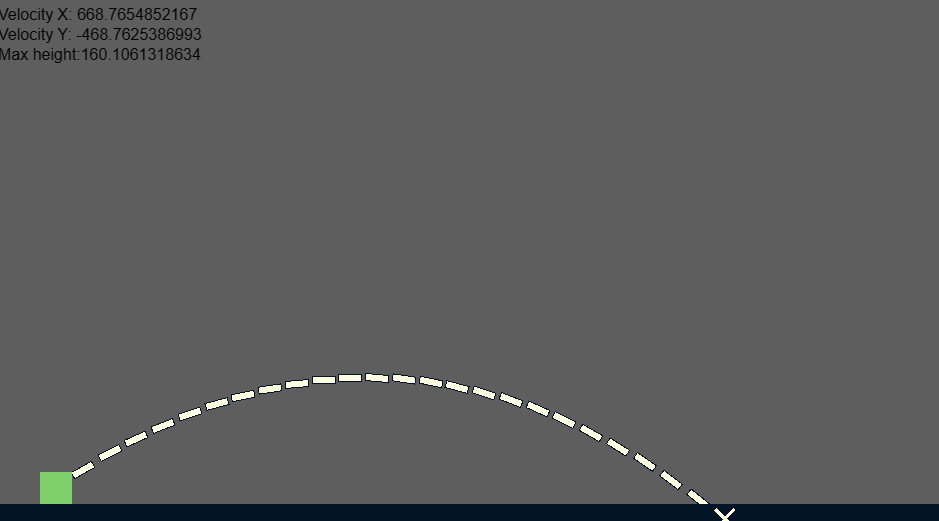

<br>
# Trajectory <br>
A Trajectory behavior for Construct 3, Simulate 2D physics trajectory and projectile motion. simulates the motion of an object that is thrown, launched, or otherwise projected <br>
<br>
Author: piranha305 <br>
<sub>Made using [c3ide2-framework](https://github.com/ConstructFund/c3ide2-framework) </sub><br>

## Table of Contents
- [Usage](#usage)
- [Examples Files](#examples-files)
- [Properties](#properties)
- [Actions](#actions)
- [Conditions](#conditions)
- [Expressions](#expressions)
---
## Usage
To build the addon, run the following commands:

```
npm i
node ./build.js
```

To run the dev server, run

```
npm i
node ./dev.js
```

The build uses the pluginConfig file to generate everything else.
The main files you may want to look at would be instance.js and scriptInterface.js

## Examples Files
- [piranha305_trajectory_example](./examples/piranha305_trajectory_example.c3p)
</br>

</br>

---
## Properties
| Property Name | Description
| --- | --- |
| [Enabled](#enabled) | Enabled |
| [Velocity](#velocity) | Velocity, in pixels per second |
| [Angle](#angle) | Angle, in degrees, to launch the projectile at |
| [Gravity](#gravity) | Gravity, in pixels per second squared |
| [Gravity Angle](#gravity-angle) | Gravity Angle, in degrees |
| [Stop On Solid](#stop-on-solid) | Stops the projectile movement when colliding with a Solid |
| [Set Movement Angle](#set-movement-angle) | Set movement angle to match the direction of the trajectory |
---
### Enabled
**Description:** <br> Enabled </br>
**Type:** <br> check
### Velocity
**Description:** <br> Velocity, in pixels per second </br>
**Type:** <br> integer
### Angle
**Description:** <br> Angle, in degrees, to launch the projectile at </br>
**Type:** <br> integer
### Gravity
**Description:** <br> Gravity, in pixels per second squared </br>
**Type:** <br> integer
### Gravity Angle
**Description:** <br> Gravity Angle, in degrees </br>
**Type:** <br> integer
### Stop On Solid
**Description:** <br> Stops the projectile movement when colliding with a Solid </br>
**Type:** <br> check
### Set Movement Angle
**Description:** <br> Set movement angle to match the direction of the trajectory </br>
**Type:** <br> check

---
## Actions
| Action | Description |
| --- | --- |
| [Set Enabled](#set-enabled) | Set Enabled |
| [Set Gravity Angle](#set-gravity-angle) | Set Gravity Angle |
| [Set Trajectory By Velocity](#set-trajectory-by-velocity) | Set Trajectory By Velocity |
| [Set Trajectory By Target](#set-trajectory-by-target) | Set Trajectory By Target |
| [Draw Trajectory](#draw-trajectory) | Draw Trajectory |
| [Draw Trajectory With End Sprite](#draw-trajectory-with-end-sprite) | Draw Trajectory |
| [Clear Drawn Trajectory](#clear-drawn-trajectory) | Clear Drawn Trajectory |
---
### Set Enabled
**Description:** <br> Set Enabled </br>
#### Parameters:
| Name | Type | Description |
| --- | --- | --- |
| Enabled | boolean | Enabled |
### Set Gravity Angle
**Description:** <br> Set Gravity Angle </br>
#### Parameters:
| Name | Type | Description |
| --- | --- | --- |
| Gravity Angle | number | Gravity Angle, in degrees |
### Set Trajectory By Velocity
**Description:** <br> Set Trajectory By Velocity </br>
#### Parameters:
| Name | Type | Description |
| --- | --- | --- |
| Velocity | number | Velocity, in pixels per second |
| Angle | number | Angle, in degrees |
| Start Instantly | boolean | Start moving along the trajectory instantly |
| Stop On Solid | boolean | Stops the projectile movement when colliding with a Solid |
| Set Movement Angle | boolean | Set movement angle to match the direction of the trajectory |
### Set Trajectory By Target
**Description:** <br> Set Trajectory By Target </br>
#### Parameters:
| Name | Type | Description |
| --- | --- | --- |
| Target X | number | Target X |
| Target Y | number | Target Y |
| Time | number | Time, in seconds |
| Start Instantly | boolean | Start moving along the trajectory instantly |
| Stop On Solid | boolean | Stops the projectile movement when colliding with a Solid |
| Set Movement Angle | boolean | Set movement angle to match the direction of the trajectory |
### Draw Trajectory
**Description:** <br> Draw Trajectory </br>
#### Parameters:
| Name | Type | Description |
| --- | --- | --- |
| Sprite | object | The Sprite used to draw the trajectory |
| Layer | layer | The Layer used to draw the trajectory |
| Steps | number | The number of steps to draw |
| Time | number | Time, in seconds to draw |
| Set Sprite Angle | boolean | Set Sprite direction angle to match the direction of the trajectory |
### Draw Trajectory With End Sprite
**Description:** <br> Draw Trajectory </br>
#### Parameters:
| Name | Type | Description |
| --- | --- | --- |
| Sprite | object | The Sprite used to draw the trajectory |
| End Cap Sprite | object | The Sprite to draw at the end of the trajectory path |
| Layer | layer | The Layer used to draw the trajectory |
| Steps | number | The number of steps to draw |
| Time | number | Time, in seconds to draw of the trajectory |
| Set Sprite Angle | boolean | Set sprite direction angle to match the direction of the trajectory |
### Clear Drawn Trajectory
**Description:** <br> Clear Drawn Trajectory </br>

---
## Conditions
| Condition | Description |
| --- | --- |
| [Is Enabled](#is-enabled) | Is Enabled |
| [On Hit Solid](#on-hit-solid) | Triggered when the projectile hits a solid object |
| [On Start Moving Along Trajectory](#on-start-moving-along-trajectory) | Triggered when the object starts moving along the trajectory |
| [Is Moving Along Trajectory](#is-moving-along-trajectory) | Is Moving Along Trajectory |
---
### Is Enabled
**Description:** <br> Is Enabled </br>
### On Hit Solid
**Description:** <br> Triggered when the projectile hits a solid object </br>
**Is Trigger:** <br> true </br>
### On Start Moving Along Trajectory
**Description:** <br> Triggered when the object starts moving along the trajectory </br>
**Is Trigger:** <br> true </br>
### Is Moving Along Trajectory
**Description:** <br> Is Moving Along Trajectory </br>

---
## Expressions
| Expression | Description |
| --- | --- |
| [GetXAt](#getxat) | Get X At |
| [GetYAt](#getyat) | Get Y At |
| [GetVelocityX](#getvelocityx) | Get Velocity X |
| [GetVelocityY](#getvelocityy) | Get Velocity Y |
| [GetAngleAt](#getangleat) | Get Angle At |
| [GetMaxHeight](#getmaxheight) | Get Max Height (in pixels) |
---
### GetXAt
**Description:** <br> Get X At </br>
**Return Type:** <br> number </br>
#### Parameters:
| Name | Type | Description |
| --- | --- | --- |
| Time | number | Time, in seconds |
### GetYAt
**Description:** <br> Get Y At </br>
**Return Type:** <br> number </br>
#### Parameters:
| Name | Type | Description |
| --- | --- | --- |
| Time | number | Time, in seconds |
### GetVelocityX
**Description:** <br> Get Velocity X </br>
**Return Type:** <br> number </br>
### GetVelocityY
**Description:** <br> Get Velocity Y </br>
**Return Type:** <br> number </br>
### GetAngleAt
**Description:** <br> Get Angle At </br>
**Return Type:** <br> number </br>
#### Parameters:
| Name | Type | Description |
| --- | --- | --- |
| Time | number | Time, in seconds |
### GetMaxHeight
**Description:** <br> Get Max Height (in pixels) </br>
**Return Type:** <br> number </br>