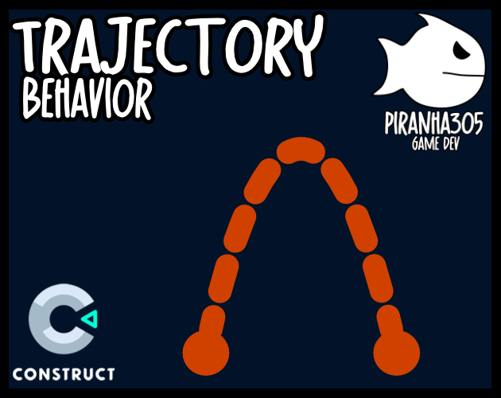

<br>
# Trajectory <br>
A Trajectory behavior for Construct 3, Simulate 2D physics trajectory and projectile motion. simulates the motion of an object that is thrown, launched, or otherwise projected <br>
<br>
Author: piranha305 <br>
<sub>Made using [c3ide2-framework](https://github.com/ConstructFund/c3ide2-framework) </sub><br>

## Table of Contents
- [Usage](#usage)
- [Examples Files](#examples-files)
- [Properties](#properties)
- [Actions](#actions)
- [Conditions](#conditions)
- [Expressions](#expressions)
---
## Usage
To build the addon, run the following commands:

```
npm i
node ./build.js
```

To run the dev server, run

```
npm i
node ./dev.js
```

The build uses the pluginConfig file to generate everything else.
The main files you may want to look at would be instance.js and scriptInterface.js

## Examples Files
- [piranha305_trajectory_example](./examples/piranha305_trajectory_example.c3p)
</br>

</br>

---
## Properties
| Property Name | Description | Type |
| --- | --- | --- |
| Enabled | If Enabled, the object will move along the trajectory paths | check |
| Velocity | Speed which the object will move in pixels per second | integer |
| Angle | Angle, in degrees, to launch the projectile at | integer |
| Gravity | Force applied every tick, in pixels per second squared | integer |
| Gravity Angle | Angle in which the gravity force will be applied, in degrees | integer |
| Stop On Solid | Stops the projectile movement when colliding with a Solid | check |
| Set Movement Angle | Set movement angle to match the direction of the trajectory | check |


---
## Actions
| Action | Description | Params
| --- | --- | --- |
| Set Enabled | Sets the behavior as enabled (if true, the object will move along the trajectory paths) | Enabled             *(boolean)* <br> |
| Set Gravity Angle | Set the angle in which gravity force will be applied, in degrees | Gravity Angle             *(number)* <br> |
| Set Trajectory By Velocity | Calculate the trajectory based on the velocity and launch angle | Velocity             *(number)* <br>Launch Angle             *(number)* <br>Start Instantly             *(boolean)* <br>Stop On Solid             *(boolean)* <br>Set Movement Angle             *(boolean)* <br> |
| Set Trajectory By Target | Calculate the trajectory based on the target position and time | Target X             *(number)* <br>Target Y             *(number)* <br>Time             *(number)* <br>Start Instantly             *(boolean)* <br>Stop On Solid             *(boolean)* <br>Set Movement Angle             *(boolean)* <br> |
| Set Trajectory By Target Angle | Calculate the trajectory based on the target position and launch angle | Target X             *(number)* <br>Target Y             *(number)* <br>Launch Angle             *(number)* <br>Start Instantly             *(boolean)* <br>Stop On Solid             *(boolean)* <br>Set Movement Angle             *(boolean)* <br> |
| Draw Trajectory | Draw the trajectory using a Sprite | Sprite             *(object)* <br>Layer             *(layer)* <br>Steps             *(number)* <br>Time             *(number)* <br>Set Sprite Angle             *(boolean)* <br> |
| Draw Trajectory With End Sprite | Draw the trajectory using a Sprite and an end cap Sprite | Sprite             *(object)* <br>End Cap Sprite             *(object)* <br>Layer             *(layer)* <br>Steps             *(number)* <br>Time             *(number)* <br>Set Sprite Angle             *(boolean)* <br> |
| Clear Drawn Trajectory | Clear the drawn trajectory |  |
| Predict Trajectory Collision | Predict where a collision with a solid object will occur along the trajectory | Steps             *(number)* <br>Time             *(number)* <br> |


---
## Conditions
| Condition | Description | Params
| --- | --- | --- |
| Is Enabled | Check if the trajectory behavior is enabled |  |
| On Hit Solid | Triggered when the projectile hits a solid object |  |
| On Start Moving Along Trajectory | Triggered when the object starts moving along the trajectory |  |
| Is Moving Along Trajectory | ICheck if the object is moving along the trajectory |  |
| For Each Step In Trajectory | Loop through each step in the trajectory | Steps *(number)* <br>Time *(number)* <br> |
| On Predicted Collision Found | Triggered when the 'Predict Trajectory Collision' action finds a collision with a solid object |  |
| No Predicted Collision Found | Triggerd when the 'Predict Trajectory Collision' action does not find a collision with a solid object |  |


---
## Expressions
| Expression | Description | Return Type | Params
| --- | --- | --- | --- |
| GetXAt | Get the X position at a given time, in seconds | number | Time *(number)* <br> | 
| GetYAt | Get the Y position at a given time, in seconds | number | Time *(number)* <br> | 
| GetVelocityX | Get the current velocity X, in pixels per second | number |  | 
| GetVelocityY | Get the current velocity Y, in pixels per second | number |  | 
| GetAngleAt | Get the angle at a given time, in seconds | number | Time *(number)* <br> | 
| GetMaxHeight | Get the maximum height of the trajectory, in pixels | number |  | 
| GetLoopTimeStep | Get the time step, in seconds, between each loop iteration | number |  | 
| GetLoopX | Get the current X position, between each loop iteration | number |  | 
| GetLoopY | Get the current Y position, between each loop iteration | number |  | 
| GetLoopAngle |  Get the current angle, in degrees, between each loop iteration | number |  | 
| GetCollisionX | Get X position from Predicted Trajectory Collision | number |  | 
| GetCollisionY | Get Y position from Predicted Trajectory Collision | number |  | 
